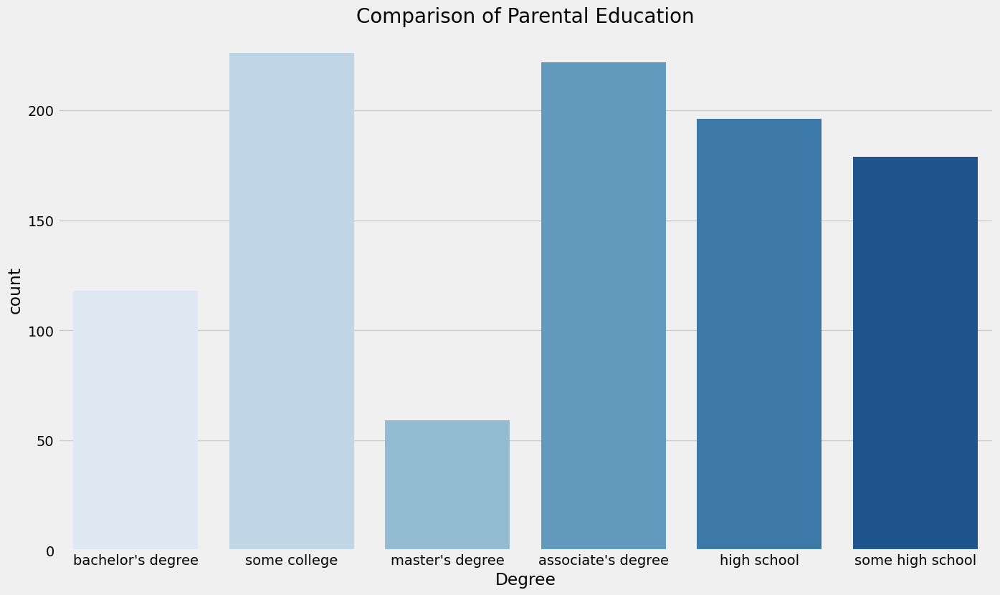

## Student Performance Indicator


#### Life cycle of Machine learning Project

- Understanding the Problem Statement
- Data Collection
- Data Checks to perform
- Exploratory data analysis
- Data Pre-Processing
- Model Training
- Choose best model

### 1) Problem statement
- This project understands how the student's performance (test scores) is affected by other variables such as Gender, Ethnicity, Parental level of education, Lunch and Test preparation course.


### 2) Data Collection
- Dataset Source - https://www.kaggle.com/datasets/spscientist/students-performance-in-exams?datasetId=74977
- The data consists of 8 column and 1000 rows.

### 2.1 Import Data and Required Packages
####  Importing Pandas, Numpy, Matplotlib, Seaborn and Warings Library.


```python
import numpy as np
import pandas as pd
import seaborn as sns
import matplotlib.pyplot as plt
%matplotlib inline
import warnings
warnings.filterwarnings('ignore')
```

#### Import the CSV Data as Pandas DataFrame


```python
df = pd.read_csv('data/stud.csv')
```

#### Show Top 5 Records


```python
df.head()
```


<div>
<style scoped>
    .dataframe tbody tr th:only-of-type {
        vertical-align: middle;
    }

    .dataframe tbody tr th {
        vertical-align: top;
    }

    .dataframe thead th {
        text-align: right;
    }
</style>
<table border="1" class="dataframe">
  <thead>
    <tr style="text-align: right;">
      <th></th>
      <th>gender</th>
      <th>race_ethnicity</th>
      <th>parental_level_of_education</th>
      <th>lunch</th>
      <th>test_preparation_course</th>
      <th>math_score</th>
      <th>reading_score</th>
      <th>writing_score</th>
    </tr>
  </thead>
  <tbody>
    <tr>
      <th>0</th>
      <td>female</td>
      <td>group B</td>
      <td>bachelor's degree</td>
      <td>standard</td>
      <td>none</td>
      <td>72</td>
      <td>72</td>
      <td>74</td>
    </tr>
    <tr>
      <th>1</th>
      <td>female</td>
      <td>group C</td>
      <td>some college</td>
      <td>standard</td>
      <td>completed</td>
      <td>69</td>
      <td>90</td>
      <td>88</td>
    </tr>
    <tr>
      <th>2</th>
      <td>female</td>
      <td>group B</td>
      <td>master's degree</td>
      <td>standard</td>
      <td>none</td>
      <td>90</td>
      <td>95</td>
      <td>93</td>
    </tr>
    <tr>
      <th>3</th>
      <td>male</td>
      <td>group A</td>
      <td>associate's degree</td>
      <td>free/reduced</td>
      <td>none</td>
      <td>47</td>
      <td>57</td>
      <td>44</td>
    </tr>
    <tr>
      <th>4</th>
      <td>male</td>
      <td>group C</td>
      <td>some college</td>
      <td>standard</td>
      <td>none</td>
      <td>76</td>
      <td>78</td>
      <td>75</td>
    </tr>
  </tbody>
</table>
</div>


#### Shape of the dataset


```python
df.shape
```


    (1000, 8)


### 2.2 Dataset information

- gender : sex of students  -> (Male/female)
- race/ethnicity : ethnicity of students -> (Group A, B,C, D,E)
- parental level of education : parents' final education ->(bachelor's degree,some college,master's degree,associate's degree,high school)
- lunch : having lunch before test (standard or free/reduced) 
- test preparation course : complete or not complete before test
- math score
- reading score
- writing score

### 3. Data Checks to perform

- Check Missing values
- Check Duplicates
- Check data type
- Check the number of unique values of each column
- Check statistics of data set
- Check various categories present in the different categorical column

### 3.1 Check Missing values


```python
df.isna().sum()
```


    gender                         0
    race_ethnicity                 0
    parental_level_of_education    0
    lunch                          0
    test_preparation_course        0
    math_score                     0
    reading_score                  0
    writing_score                  0
    dtype: int64


#### There are no missing values in the data set

### 3.2 Check Duplicates


```python
df.duplicated().sum()
```


    0


#### There are no duplicates  values in the data set

### 3.3 Check data types


```python
# Check Null and Dtypes
df.info()
```

    <class 'pandas.core.frame.DataFrame'>
    RangeIndex: 1000 entries, 0 to 999
    Data columns (total 8 columns):
     #   Column                       Non-Null Count  Dtype 
    ---  ------                       --------------  ----- 
     0   gender                       1000 non-null   object
     1   race_ethnicity               1000 non-null   object
     2   parental_level_of_education  1000 non-null   object
     3   lunch                        1000 non-null   object
     4   test_preparation_course      1000 non-null   object
     5   math_score                   1000 non-null   int64 
     6   reading_score                1000 non-null   int64 
     7   writing_score                1000 non-null   int64 
    dtypes: int64(3), object(5)
    memory usage: 62.6+ KB


### 3.4 Checking the number of unique values of each column


```python
df.nunique()
```


    gender                          2
    race_ethnicity                  5
    parental_level_of_education     6
    lunch                           2
    test_preparation_course         2
    math_score                     81
    reading_score                  72
    writing_score                  77
    dtype: int64


### 3.5 Check statistics of data set


```python
df.describe()
```


<div>
<style scoped>
    .dataframe tbody tr th:only-of-type {
        vertical-align: middle;
    }

    .dataframe tbody tr th {
        vertical-align: top;
    }

    .dataframe thead th {
        text-align: right;
    }
</style>
<table border="1" class="dataframe">
  <thead>
    <tr style="text-align: right;">
      <th></th>
      <th>math_score</th>
      <th>reading_score</th>
      <th>writing_score</th>
    </tr>
  </thead>
  <tbody>
    <tr>
      <th>count</th>
      <td>1000.00000</td>
      <td>1000.000000</td>
      <td>1000.000000</td>
    </tr>
    <tr>
      <th>mean</th>
      <td>66.08900</td>
      <td>69.169000</td>
      <td>68.054000</td>
    </tr>
    <tr>
      <th>std</th>
      <td>15.16308</td>
      <td>14.600192</td>
      <td>15.195657</td>
    </tr>
    <tr>
      <th>min</th>
      <td>0.00000</td>
      <td>17.000000</td>
      <td>10.000000</td>
    </tr>
    <tr>
      <th>25%</th>
      <td>57.00000</td>
      <td>59.000000</td>
      <td>57.750000</td>
    </tr>
    <tr>
      <th>50%</th>
      <td>66.00000</td>
      <td>70.000000</td>
      <td>69.000000</td>
    </tr>
    <tr>
      <th>75%</th>
      <td>77.00000</td>
      <td>79.000000</td>
      <td>79.000000</td>
    </tr>
    <tr>
      <th>max</th>
      <td>100.00000</td>
      <td>100.000000</td>
      <td>100.000000</td>
    </tr>
  </tbody>
</table>
</div>


#### Insight
- From above description of numerical data, all means are very close to each other - between 66 and 68.05;
- All standard deviations are also close - between 14.6 and 15.19;
- While there is a minimum score  0 for math, for writing minimum is much higher = 10 and for reading yet higher = 17

### 3.7 Exploring Data


```python
df.head()
```


<div>
<style scoped>
    .dataframe tbody tr th:only-of-type {
        vertical-align: middle;
    }

    .dataframe tbody tr th {
        vertical-align: top;
    }

    .dataframe thead th {
        text-align: right;
    }
</style>
<table border="1" class="dataframe">
  <thead>
    <tr style="text-align: right;">
      <th></th>
      <th>gender</th>
      <th>race_ethnicity</th>
      <th>parental_level_of_education</th>
      <th>lunch</th>
      <th>test_preparation_course</th>
      <th>math_score</th>
      <th>reading_score</th>
      <th>writing_score</th>
    </tr>
  </thead>
  <tbody>
    <tr>
      <th>0</th>
      <td>female</td>
      <td>group B</td>
      <td>bachelor's degree</td>
      <td>standard</td>
      <td>none</td>
      <td>72</td>
      <td>72</td>
      <td>74</td>
    </tr>
    <tr>
      <th>1</th>
      <td>female</td>
      <td>group C</td>
      <td>some college</td>
      <td>standard</td>
      <td>completed</td>
      <td>69</td>
      <td>90</td>
      <td>88</td>
    </tr>
    <tr>
      <th>2</th>
      <td>female</td>
      <td>group B</td>
      <td>master's degree</td>
      <td>standard</td>
      <td>none</td>
      <td>90</td>
      <td>95</td>
      <td>93</td>
    </tr>
    <tr>
      <th>3</th>
      <td>male</td>
      <td>group A</td>
      <td>associate's degree</td>
      <td>free/reduced</td>
      <td>none</td>
      <td>47</td>
      <td>57</td>
      <td>44</td>
    </tr>
    <tr>
      <th>4</th>
      <td>male</td>
      <td>group C</td>
      <td>some college</td>
      <td>standard</td>
      <td>none</td>
      <td>76</td>
      <td>78</td>
      <td>75</td>
    </tr>
  </tbody>
</table>
</div>


```python
print("Categories in 'gender' variable:     ",end=" " )
print(df['gender'].unique())

print("Categories in 'race_ethnicity' variable:  ",end=" ")
print(df['race_ethnicity'].unique())

print("Categories in'parental level of education' variable:",end=" " )
print(df['parental_level_of_education'].unique())

print("Categories in 'lunch' variable:     ",end=" " )
print(df['lunch'].unique())

print("Categories in 'test preparation course' variable:     ",end=" " )
print(df['test_preparation_course'].unique())
```

    Categories in 'gender' variable:      ['female' 'male']
    Categories in 'race_ethnicity' variable:   ['group B' 'group C' 'group A' 'group D' 'group E']
    Categories in'parental level of education' variable: ["bachelor's degree" 'some college' "master's degree" "associate's degree"
     'high school' 'some high school']
    Categories in 'lunch' variable:      ['standard' 'free/reduced']
    Categories in 'test preparation course' variable:      ['none' 'completed']


```python
# define numerical & categorical columns
numeric_features = [feature for feature in df.columns if df[feature].dtype != 'O']
categorical_features = [feature for feature in df.columns if df[feature].dtype == 'O']

# print columns
print('We have {} numerical features : {}'.format(len(numeric_features), numeric_features))
print('\nWe have {} categorical features : {}'.format(len(categorical_features), categorical_features))
```

    We have 3 numerical features : ['math_score', 'reading_score', 'writing_score']
    
    We have 5 categorical features : ['gender', 'race_ethnicity', 'parental_level_of_education', 'lunch', 'test_preparation_course']


```python
df.head(2)
```


<div>
<style scoped>
    .dataframe tbody tr th:only-of-type {
        vertical-align: middle;
    }

    .dataframe tbody tr th {
        vertical-align: top;
    }

    .dataframe thead th {
        text-align: right;
    }
</style>
<table border="1" class="dataframe">
  <thead>
    <tr style="text-align: right;">
      <th></th>
      <th>gender</th>
      <th>race_ethnicity</th>
      <th>parental_level_of_education</th>
      <th>lunch</th>
      <th>test_preparation_course</th>
      <th>math_score</th>
      <th>reading_score</th>
      <th>writing_score</th>
    </tr>
  </thead>
  <tbody>
    <tr>
      <th>0</th>
      <td>female</td>
      <td>group B</td>
      <td>bachelor's degree</td>
      <td>standard</td>
      <td>none</td>
      <td>72</td>
      <td>72</td>
      <td>74</td>
    </tr>
    <tr>
      <th>1</th>
      <td>female</td>
      <td>group C</td>
      <td>some college</td>
      <td>standard</td>
      <td>completed</td>
      <td>69</td>
      <td>90</td>
      <td>88</td>
    </tr>
  </tbody>
</table>
</div>


```python

```

### 3.8 Adding columns for "Total Score" and "Average"


```python
df['total score'] = df['math_score'] + df['reading_score'] + df['writing_score']
df['average'] = df['total score']/3
df.head()
```


<div>
<style scoped>
    .dataframe tbody tr th:only-of-type {
        vertical-align: middle;
    }

    .dataframe tbody tr th {
        vertical-align: top;
    }

    .dataframe thead th {
        text-align: right;
    }
</style>
<table border="1" class="dataframe">
  <thead>
    <tr style="text-align: right;">
      <th></th>
      <th>gender</th>
      <th>race_ethnicity</th>
      <th>parental_level_of_education</th>
      <th>lunch</th>
      <th>test_preparation_course</th>
      <th>math_score</th>
      <th>reading_score</th>
      <th>writing_score</th>
      <th>total score</th>
      <th>average</th>
    </tr>
  </thead>
  <tbody>
    <tr>
      <th>0</th>
      <td>female</td>
      <td>group B</td>
      <td>bachelor's degree</td>
      <td>standard</td>
      <td>none</td>
      <td>72</td>
      <td>72</td>
      <td>74</td>
      <td>218</td>
      <td>72.666667</td>
    </tr>
    <tr>
      <th>1</th>
      <td>female</td>
      <td>group C</td>
      <td>some college</td>
      <td>standard</td>
      <td>completed</td>
      <td>69</td>
      <td>90</td>
      <td>88</td>
      <td>247</td>
      <td>82.333333</td>
    </tr>
    <tr>
      <th>2</th>
      <td>female</td>
      <td>group B</td>
      <td>master's degree</td>
      <td>standard</td>
      <td>none</td>
      <td>90</td>
      <td>95</td>
      <td>93</td>
      <td>278</td>
      <td>92.666667</td>
    </tr>
    <tr>
      <th>3</th>
      <td>male</td>
      <td>group A</td>
      <td>associate's degree</td>
      <td>free/reduced</td>
      <td>none</td>
      <td>47</td>
      <td>57</td>
      <td>44</td>
      <td>148</td>
      <td>49.333333</td>
    </tr>
    <tr>
      <th>4</th>
      <td>male</td>
      <td>group C</td>
      <td>some college</td>
      <td>standard</td>
      <td>none</td>
      <td>76</td>
      <td>78</td>
      <td>75</td>
      <td>229</td>
      <td>76.333333</td>
    </tr>
  </tbody>
</table>
</div>


```python
reading_full = df[df['reading_score'] == 100]['average'].count()
writing_full = df[df['writing_score'] == 100]['average'].count()
math_full = df[df['math_score'] == 100]['average'].count()

print(f'Number of students with full marks in Maths: {math_full}')
print(f'Number of students with full marks in Writing: {writing_full}')
print(f'Number of students with full marks in Reading: {reading_full}')
```

    Number of students with full marks in Maths: 7
    Number of students with full marks in Writing: 14
    Number of students with full marks in Reading: 17


```python
reading_less_20 = df[df['reading_score'] <= 20]['average'].count()
writing_less_20 = df[df['writing_score'] <= 20]['average'].count()
math_less_20 = df[df['math_score'] <= 20]['average'].count()

print(f'Number of students with less than 20 marks in Maths: {math_less_20}')
print(f'Number of students with less than 20 marks in Writing: {writing_less_20}')
print(f'Number of students with less than 20 marks in Reading: {reading_less_20}')
```

    Number of students with less than 20 marks in Maths: 4
    Number of students with less than 20 marks in Writing: 3
    Number of students with less than 20 marks in Reading: 1


#####  Insights
 - From above values we get students have performed the worst in Maths 
 - Best performance is in reading section

### 4. Exploring Data ( Visualization )
#### 4.1 Visualize average score distribution to make some conclusion. 
- Histogram
- Kernel Distribution Function (KDE)

#### 4.1.1 Histogram & KDE


```python
fig, axs = plt.subplots(1, 2, figsize=(15, 7))
plt.subplot(121)
sns.histplot(data=df,x='average',bins=30,kde=True,color='g')
plt.subplot(122)
sns.histplot(data=df,x='average',kde=True,hue='gender')
plt.show()
```


    

    


```python
fig, axs = plt.subplots(1, 2, figsize=(15, 7))
plt.subplot(121)
sns.histplot(data=df,x='total score',bins=30,kde=True,color='g')
plt.subplot(122)
sns.histplot(data=df,x='total score',kde=True,hue='gender')
plt.show()
```


    

    


#####  Insights
- Female students tend to perform well then male students.


```python
plt.subplots(1,3,figsize=(25,6))
plt.subplot(141)
sns.histplot(data=df,x='average',kde=True,hue='lunch')
plt.subplot(142)
sns.histplot(data=df[df.gender=='female'],x='average',kde=True,hue='lunch')
plt.subplot(143)
sns.histplot(data=df[df.gender=='male'],x='average',kde=True,hue='lunch')
plt.show()
```


    

    


#####  Insights
- Standard lunch helps perform well in exams.
- Standard lunch helps perform well in exams be it a male or a female.


```python
plt.subplots(1,3,figsize=(25,6))
plt.subplot(141)
ax =sns.histplot(data=df,x='average',kde=True,hue='parental_level_of_education')
plt.subplot(142)
ax =sns.histplot(data=df[df.gender=='male'],x='average',kde=True,hue='parental_level_of_education')
plt.subplot(143)
ax =sns.histplot(data=df[df.gender=='female'],x='average',kde=True,hue='parental_level_of_education')
plt.show()
```


    

    


#####  Insights
- In general parent's education don't help student perform well in exam.
- 2nd plot shows that parent's whose education is of associate's degree or master's degree their male child tend to perform well in exam
- 3rd plot we can see there is no effect of parent's education on female students.


```python
plt.subplots(1,3,figsize=(25,6))
plt.subplot(141)
ax =sns.histplot(data=df,x='average',kde=True,hue='race_ethnicity')
plt.subplot(142)
ax =sns.histplot(data=df[df.gender=='female'],x='average',kde=True,hue='race_ethnicity')
plt.subplot(143)
ax =sns.histplot(data=df[df.gender=='male'],x='average',kde=True,hue='race_ethnicity')
plt.show()
```


    

    


#####  Insights
- Students of group A and group B tend to perform poorly in exam.
- Students of group A and group B tend to perform poorly in exam irrespective of whether they are male or female

#### 4.2 Maximumum score of students in all three subjects


```python

plt.figure(figsize=(18,8))
plt.subplot(1, 4, 1)
plt.title('MATH SCORES')
sns.violinplot(y='math_score',data=df,color='red',linewidth=3)
plt.subplot(1, 4, 2)
plt.title('READING SCORES')
sns.violinplot(y='reading_score',data=df,color='green',linewidth=3)
plt.subplot(1, 4, 3)
plt.title('WRITING SCORES')
sns.violinplot(y='writing_score',data=df,color='blue',linewidth=3)
plt.show()
```


    

    


#### Insights
- From the above three plots its clearly visible that most of the students score in between 60-80 in Maths whereas in reading and writing most of them score from 50-80

#### 4.3 Multivariate analysis using pieplot


```python
plt.rcParams['figure.figsize'] = (30, 12)

plt.subplot(1, 5, 1)
size = df['gender'].value_counts()
labels = 'Female', 'Male'
color = ['red','green']


plt.pie(size, colors = color, labels = labels,autopct = '.%2f%%')
plt.title('Gender', fontsize = 20)
plt.axis('off')


plt.subplot(1, 5, 2)
size = df['race_ethnicity'].value_counts()
labels = 'Group C', 'Group D','Group B','Group E','Group A'
color = ['red', 'green', 'blue', 'cyan','orange']

plt.pie(size, colors = color,labels = labels,autopct = '.%2f%%')
plt.title('Race/Ethnicity', fontsize = 20)
plt.axis('off')


plt.subplot(1, 5, 3)
size = df['lunch'].value_counts()
labels = 'Standard', 'Free'
color = ['red','green']

plt.pie(size, colors = color,labels = labels,autopct = '.%2f%%')
plt.title('Lunch', fontsize = 20)
plt.axis('off')


plt.subplot(1, 5, 4)
size = df['test_preparation_course'].value_counts()
labels = 'None', 'Completed'
color = ['red','green']

plt.pie(size, colors = color,labels = labels,autopct = '.%2f%%')
plt.title('Test Course', fontsize = 20)
plt.axis('off')


plt.subplot(1, 5, 5)
size = df['parental_level_of_education'].value_counts()
labels = 'Some College', "Associate's Degree",'High School','Some High School',"Bachelor's Degree","Master's Degree"
color = ['red', 'green', 'blue', 'cyan','orange','grey']

plt.pie(size, colors = color,labels = labels,autopct = '.%2f%%')
plt.title('Parental Education', fontsize = 20)
plt.axis('off')


plt.tight_layout()
plt.grid()

plt.show()
```


    

    


#####  Insights
- Number of Male and Female students is almost equal
- Number students are greatest in Group C
- Number of students who have standard lunch are greater
- Number of students who have not enrolled in any test preparation course is greater
- Number of students whose parental education is "Some College" is greater followed closely by "Associate's Degree"

#### 4.4 Feature Wise Visualization
#### 4.4.1 GENDER COLUMN
- How is distribution of Gender ?
- Is gender has any impact on student's performance ?

#### UNIVARIATE ANALYSIS ( How is distribution of Gender ? )


```python
f,ax=plt.subplots(1,2,figsize=(20,10))
sns.countplot(x=df['gender'],data=df,palette ='bright',ax=ax[0],saturation=0.95)
for container in ax[0].containers:
    ax[0].bar_label(container,color='black',size=20)
    
plt.pie(x=df['gender'].value_counts(),labels=['Male','Female'],explode=[0,0.1],autopct='%1.1f%%',shadow=True,colors=['#ff4d4d','#ff8000'])
plt.show()
```


    

    


#### Insights 
- Gender has balanced data with female students are 518 (48%) and male students are 482 (52%) 

#### BIVARIATE ANALYSIS ( Is gender has any impact on student's performance ? ) 


```python
gender_group = df.groupby('gender').mean()
gender_group
```


<div>
<style scoped>
    .dataframe tbody tr th:only-of-type {
        vertical-align: middle;
    }

    .dataframe tbody tr th {
        vertical-align: top;
    }

    .dataframe thead th {
        text-align: right;
    }
</style>
<table border="1" class="dataframe">
  <thead>
    <tr style="text-align: right;">
      <th></th>
      <th>math_score</th>
      <th>reading_score</th>
      <th>writing_score</th>
      <th>total score</th>
      <th>average</th>
    </tr>
    <tr>
      <th>gender</th>
      <th></th>
      <th></th>
      <th></th>
      <th></th>
      <th></th>
    </tr>
  </thead>
  <tbody>
    <tr>
      <th>female</th>
      <td>63.633205</td>
      <td>72.608108</td>
      <td>72.467181</td>
      <td>208.708494</td>
      <td>69.569498</td>
    </tr>
    <tr>
      <th>male</th>
      <td>68.728216</td>
      <td>65.473029</td>
      <td>63.311203</td>
      <td>197.512448</td>
      <td>65.837483</td>
    </tr>
  </tbody>
</table>
</div>


```python
plt.figure(figsize=(10, 8))

X = ['Total Average','Math Average']


female_scores = [gender_group['average'][0], gender_group['math_score'][0]]
male_scores = [gender_group['average'][1], gender_group['math_score'][1]]

X_axis = np.arange(len(X))
  
plt.bar(X_axis - 0.2, male_scores, 0.4, label = 'Male')
plt.bar(X_axis + 0.2, female_scores, 0.4, label = 'Female')
  
plt.xticks(X_axis, X)
plt.ylabel("Marks")
plt.title("Total average v/s Math average marks of both the genders", fontweight='bold')
plt.legend()
plt.show()
```


    

    


#### Insights 
- On an average females have a better overall score than men.
- whereas males have scored higher in Maths.

#### 4.4.2 RACE/EHNICITY COLUMN
- How is Group wise distribution ?
- Is Race/Ehnicity has any impact on student's performance ?

#### UNIVARIATE ANALYSIS ( How is Group wise distribution ?)


```python
f,ax=plt.subplots(1,2,figsize=(20,10))
sns.countplot(x=df['race_ethnicity'],data=df,palette = 'bright',ax=ax[0],saturation=0.95)
for container in ax[0].containers:
    ax[0].bar_label(container,color='black',size=20)
    
plt.pie(x = df['race_ethnicity'].value_counts(),labels=df['race_ethnicity'].value_counts().index,explode=[0.1,0,0,0,0],autopct='%1.1f%%',shadow=True)
plt.show()   
```


    

    


#### Insights 
- Most of the student belonging from group C /group D.
- Lowest number of students belong to groupA.

#### BIVARIATE ANALYSIS ( Is Race/Ehnicity has any impact on student's performance ? )


```python
Group_data2=df.groupby('race_ethnicity')
f,ax=plt.subplots(1,3,figsize=(20,8))
sns.barplot(x=Group_data2['math_score'].mean().index,y=Group_data2['math_score'].mean().values,palette = 'mako',ax=ax[0])
ax[0].set_title('Math score',color='#005ce6',size=20)

for container in ax[0].containers:
    ax[0].bar_label(container,color='black',size=15)

sns.barplot(x=Group_data2['reading_score'].mean().index,y=Group_data2['reading_score'].mean().values,palette = 'flare',ax=ax[1])
ax[1].set_title('Reading score',color='#005ce6',size=20)

for container in ax[1].containers:
    ax[1].bar_label(container,color='black',size=15)

sns.barplot(x=Group_data2['writing_score'].mean().index,y=Group_data2['writing_score'].mean().values,palette = 'coolwarm',ax=ax[2])
ax[2].set_title('Writing score',color='#005ce6',size=20)

for container in ax[2].containers:
    ax[2].bar_label(container,color='black',size=15)
```


    

    


#### Insights 
- Group E students have scored the highest marks. 
- Group A students have scored the lowest marks. 
- Students from a lower Socioeconomic status have a lower avg in all course subjects

#### 4.4.3 PARENTAL LEVEL OF EDUCATION COLUMN
- What is educational background of student's parent ?
- Is parental education has any impact on student's performance ?

#### UNIVARIATE ANALYSIS ( What is educational background of student's parent ? )


```python
plt.rcParams['figure.figsize'] = (15, 9)
plt.style.use('fivethirtyeight')
sns.countplot(df['parental_level_of_education'], palette = 'Blues')
plt.title('Comparison of Parental Education', fontweight = 30, fontsize = 20)
plt.xlabel('Degree')
plt.ylabel('count')
plt.show()
```


    

    


#### Insights 
- Largest number of parents are from some college.

#### BIVARIATE ANALYSIS ( Is parental education has any impact on student's performance ? )


```python
df.groupby('parental_level_of_education').agg('mean').plot(kind='barh',figsize=(10,10))
plt.legend(bbox_to_anchor=(1.05, 1), loc=2, borderaxespad=0.)
plt.show()
```


    

    


#### Insights 
- The score of student whose parents possess master and bachelor level education are higher than others.

#### 4.4.4 LUNCH COLUMN 
- Which type of lunch is most common amoung students ?
- What is the effect of lunch type on test results?


#### UNIVARIATE ANALYSIS ( Which type of lunch is most common amoung students ? )


```python
plt.rcParams['figure.figsize'] = (15, 9)
plt.style.use('seaborn-talk')
sns.countplot(df['lunch'], palette = 'PuBu')
plt.title('Comparison of different types of lunch', fontweight = 30, fontsize = 20)
plt.xlabel('types of lunch')
plt.ylabel('count')
plt.show()
```


    

    


#### Insights 
- Students being served Standard lunch was more than free lunch

#### BIVARIATE ANALYSIS (  Is lunch type intake has any impact on student's performance ? )


```python
f,ax=plt.subplots(1,2,figsize=(20,8))
sns.countplot(x=df['parental_level_of_education'],data=df,palette = 'bright',hue='test_preparation_course',saturation=0.95,ax=ax[0])
ax[0].set_title('Students vs test preparation course ',color='black',size=25)
for container in ax[0].containers:
    ax[0].bar_label(container,color='black',size=20)
    
sns.countplot(x=df['parental_level_of_education'],data=df,palette = 'bright',hue='lunch',saturation=0.95,ax=ax[1])
for container in ax[1].containers:
    ax[1].bar_label(container,color='black',size=20)   
```


    

    


#### Insights 
- Students who get Standard Lunch tend to perform better than students who got free/reduced lunch

#### 4.4.5 TEST PREPARATION COURSE COLUMN 
- Which type of lunch is most common amoung students ?
- Is Test prepration course has any impact on student's performance ?

#### BIVARIATE ANALYSIS ( Is Test prepration course has any impact on student's performance ? )


```python
plt.figure(figsize=(12,6))
plt.subplot(2,2,1)
sns.barplot (x=df['lunch'], y=df['math_score'], hue=df['test_preparation_course'])
plt.subplot(2,2,2)
sns.barplot (x=df['lunch'], y=df['reading_score'], hue=df['test_preparation_course'])
plt.subplot(2,2,3)
sns.barplot (x=df['lunch'], y=df['writing_score'], hue=df['test_preparation_course'])
```


    <Axes: xlabel='lunch', ylabel='writing_score'>


    

    


#### Insights  
- Students who have completed the Test Prepration Course have scores higher in all three categories than those who haven't taken the course

#### 4.4.6 CHECKING OUTLIERS


```python
plt.subplots(1,4,figsize=(16,5))
plt.subplot(141)
sns.boxplot(df['math_score'],color='skyblue')
plt.subplot(142)
sns.boxplot(df['reading_score'],color='hotpink')
plt.subplot(143)
sns.boxplot(df['writing_score'],color='yellow')
plt.subplot(144)
sns.boxplot(df['average'],color='lightgreen')
plt.show()
```


    

    


#### 4.4.7 MUTIVARIATE ANALYSIS USING PAIRPLOT


```python
sns.pairplot(df,hue = 'gender')
plt.show()
```


    

    


#### Insights
- From the above plot it is clear that all the scores increase linearly with each other.

### 5. Conclusions
- Student's Performance is related with lunch, race, parental level education
- Females lead in pass percentage and also are top-scorers
- Student's Performance is not very much related with test preparation course
- Finishing the preparation course is benefitial.


```python

```
